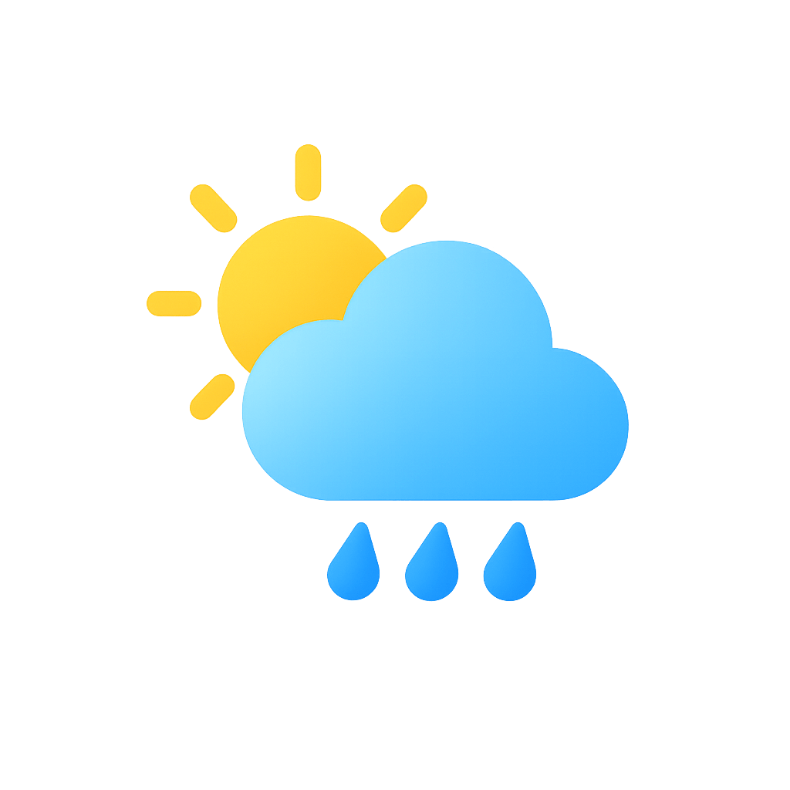

# 🌤️ Weather App - Clean Code Architecture

A simple and easy-to-use weather application that displays the current weather based on your location, built with **Flutter** using **Clean Code Architecture**.

---

## ✨ Features
- Display current weather (temperature, humidity, weather condition).
- Support for different locations via GPS.
- Simple and smooth UI built with Flutter.
- State management using BLoC.

---

## 🚀 Getting Started

1. Clone the repository:
   ```bash
   git clone https://github.com/ahmadhomsy/weather_app_flutter_clean_code_architecture.git
   ```

2. Install dependencies:
   ```bash
   flutter pub get
   ```

3. Run the app:
   ```bash
   flutter run
   ```

---

## 📸 Screenshots
<!-- Replace with your screenshots -->
  


---

## 📦 Download
You can download the latest release from [here](https://github.com/ahmadhomsy/weather_app_flutter_clean_code_architecture/releases).

---

## 🏷️ Tags & Topics
`flutter` `dart` `bloc` `firebase` `weather-app` `mobile-app` `clean-architecture`

---

## 📚 Resources
For help getting started with Flutter development, view the  
[official documentation](https://docs.flutter.dev/), which offers tutorials,  
samples, guidance on mobile development, and a full API reference.
